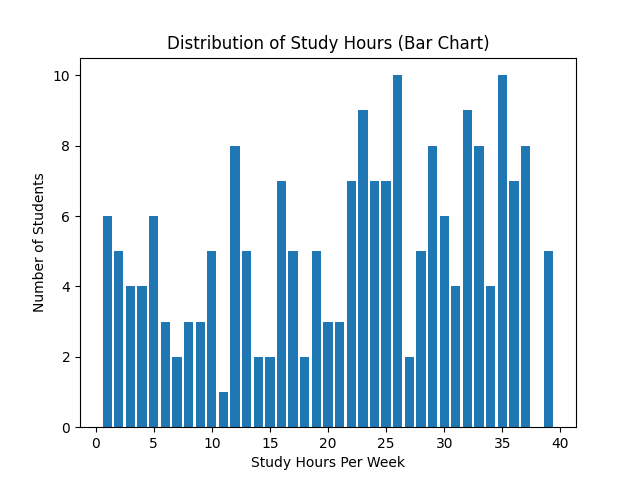
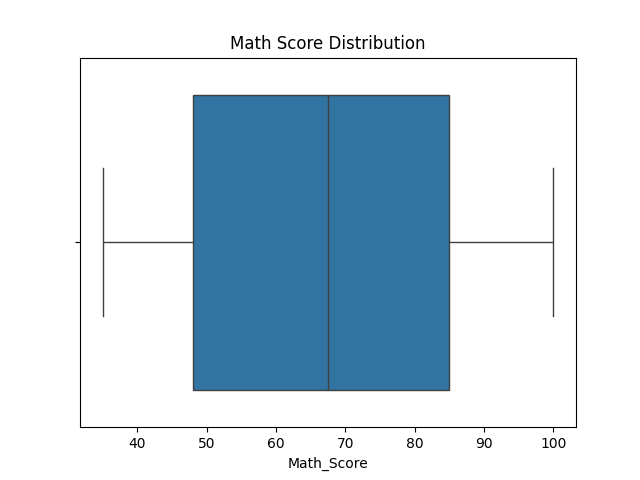
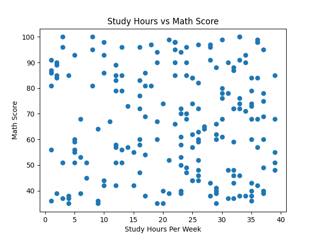
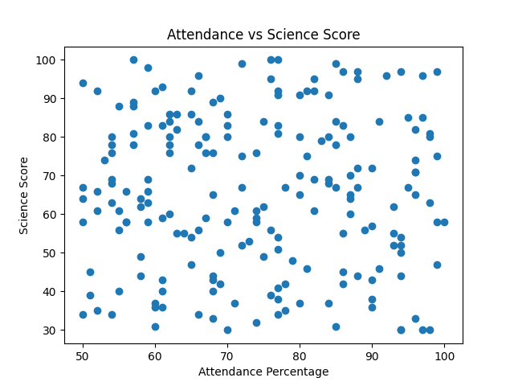
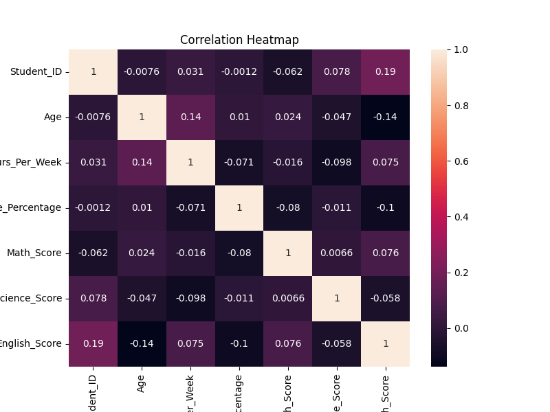

# 📊 Student Performance Exploratory Data Analysis (EDA)

## 📌 Project Overview
This project performs an Exploratory Data Analysis (EDA) on a student performance dataset to uncover patterns, trends, and relationships between academic performance and behavioral factors such as study hours and attendance.

The goal of this analysis is to demonstrate data cleaning, exploration, visualization, and insight generation using Python.

This project was completed as part of the **CodeAlpha Data Analytics Virtual Internship**.

---

## 📂 Dataset Description
The dataset contains **200 student records** with the following attributes:

| Column | Description |
|------|------------|
| Student_ID | Unique identifier for each student |
| Gender | Gender of the student |
| Age | Age of the student |
| Study_Hours_Per_Week | Weekly study hours |
| Attendance_Percentage | Attendance rate |
| Math_Score | Mathematics exam score |
| Science_Score | Science exam score |
| English_Score | English exam score |
| Internet_Access | Internet availability (Yes/No) |
| Extra_Curricular | Participation in extracurricular activities |

---

## ❓ Key Questions Explored
- Does study time affect academic performance?
- How does attendance influence exam scores?
- Is there a relationship between study hours and subject performance?
- Are there correlations among different subject scores?

---

## 🛠 Tools & Technologies Used
- **Python**
- **Pandas** – data manipulation
- **Matplotlib** – data visualization
- **Seaborn** – statistical visualizations
- **Jupyter Notebook**

---

## 📊 Exploratory Data Analysis Steps
1. Data loading and inspection  
2. Data quality checks (missing values & data types)  
3. Univariate analysis (distributions and boxplots)  
4. Bivariate analysis (scatter plots)  
5. Correlation analysis (heatmap)  
6. Insight generation  

---

## 📈 Visualizations & Insights

All visualizations are automatically saved in the `visualizations/` folder.

---

### 📊 Distribution of Study Hours
Shows how many hours students spend studying per week.

**Insight:**  
Most students study within a moderate range, indicating balanced study habits.

---

### 📦 Math Score Distribution
A boxplot showing the spread and variability of math scores.

**Insight:**  
Math scores show reasonable variation with no extreme outliers.

---

### 📈 Study Hours vs Math Score
Explores the relationship between study time and math performance.

**Insight:**  
Students who study more tend to score higher in mathematics.

---

### 📉 Attendance vs Science Score
Analyzes how attendance affects science performance.

**Insight:**  
Higher attendance is generally associated with better science scores.

---

### 🔥 Correlation Heatmap
Shows correlations between numerical variables in the dataset.

**Insight:**  
Study hours and attendance show positive correlations with academic scores.

> 📌 *All visualizations were created using Matplotlib and Seaborn.*

---

## 🔍 Key Insights
- Students who study more hours per week tend to perform better academically.
- Attendance percentage shows a positive relationship with exam scores.
- Math and Science scores are moderately correlated.
- The dataset contains no missing values, making it suitable for analysis.

---

